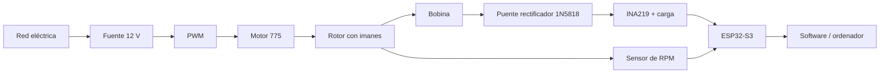

<div align="center">

# ⚡ Generador electromagnético experimental

### Manual visual de montaje, instrumentación y pruebas

**Motor 775 · Rotor con imanes · Bobina · Rectificador · INA219 · ESP32-S3 · Medición de RPM**

[](#-estado-del-proyecto)
[](#-qué-vamos-a-construir)
[](https://asturnando.github.io/generador/)

</div>

---

## 🎯 Qué es este proyecto

Este repositorio contiene el **manual vivo de construcción de una maqueta de generación electromagnética**.

El objetivo no es simplemente conseguir que se encienda algo, sino construir un banco de pruebas que permita estudiar de forma ordenada cómo cambian las medidas eléctricas al variar:

- el **número de imanes** del rotor;
- el **número de espiras** de la bobina;
- la **velocidad de giro**;
- y la configuración utilizada durante cada ensayo.

La maqueta será documentada paso a paso, con fotografías de los componentes reales, dibujos, esquemas de conexión, listas de comprobación y solución de fallos.

> La idea es que alguien que nunca haya montado un circuito pueda seguir el manual sin tener que adivinar qué significa «conectar la fuente al PWM».

---

## 🧩 Qué vamos a construir



El sistema se divide en dos partes muy claras:

### 🔵 Circuito que mueve el experimento

`Red → Fuente 12 V → PWM → Motor 775 → Rotor`

Su función es proporcionar un giro **controlado y repetible**.

### 🟢 Circuito que genera y mide

`Rotor → Bobina → Rectificador → INA219 → ESP32-S3`

Aquí es donde mediremos:

- **voltaje**;
- **corriente**;
- **potencia**;
- **RPM**;
- y posteriormente podremos registrar los ensayos en el ordenador.

---

## 🧲 Variables experimentales

La idea inicial es comparar configuraciones manteniendo el resto de condiciones lo más constantes posible.

| Variable | Configuraciones previstas |
|---|---|
| Imanes | 4 · 6 · 8 |
| Imanes principales | Neodimio redondo 15 × 2 mm |
| Espiras | 200 · 400 · 600 · 800 |
| Velocidad | Baja · media · alta |
| Medidas | V · A · W · RPM |

También disponemos de imanes rectangulares para pruebas auxiliares y un sensor Hall KY-003 como alternativa al sensor óptico de RPM.

---

## 🧰 Componentes principales

- Motor DC **775** con soporte y adaptador.
- Fuente conmutada **12 V / 10 A / 120 W**.
- Controlador **PWM 10–60 V / 20 A**.
- ESP32-S3 de **44 pines** con USB-C.
- Sensor de corriente y voltaje **INA219**.
- Sensor óptico **TCRT5000** para RPM.
- Sensor Hall **KY-003** como plan B.
- Protoboard de **830 puntos**.
- Diodos Schottky **1N5818** para construir el puente rectificador.
- Resistencias de potencia **100 Ω / 5 W**.
- Alambre de cobre esmaltado **AWG28**.
- 30 imanes redondos de neodimio **15 × 2 mm**.
- Imanes rectangulares adicionales.
- Cableado, terminales, tornillería, epoxi y elementos de fijación.

---

## 📚 Estructura del manual

El manual no se va a comprimir artificialmente. Cada operación tendrá el espacio que necesite.

| Capítulo | Contenido | Estado |
|---|---|---|
| **0** | Preparación, inventario, tablero, herramientas y seguridad | 🟢 Disponible |
| **1** | Cable de red → fuente → salida segura de 12 V | 🟢 Disponible |
| **2** | Fuente → protección/corte DC → PWM → motor 775 → primera rotación sin rotor | 🟢 Disponible |
| **3** | Rotor, patrones 4/6/8, retención, equilibrado y protección | 🟢 Disponible |
| **4** | Construcción de la bobina y derivaciones | ⚪ Pendiente |
| **5** | Puente rectificador en protoboard | ⚪ Pendiente |
| **6** | Soldadura y conexión del INA219 | ⚪ Pendiente |
| **7** | Sensor de RPM: TCRT5000 o KY-003 | ⚪ Pendiente |
| **8** | Software, calibración y registro de datos | ⚪ Pendiente |
| **9** | Plan de ensayos y análisis de resultados | ⚪ Pendiente |
| **10** | Fallos frecuentes y diagnóstico | ⚪ Pendiente |
| **11** | Presentación y defensa del proyecto | ⚪ Pendiente |

---

## 🌐 Manual web

La versión visual del manual se publicará mediante **GitHub Pages**:

### 👉 https://asturnando.github.io/generador/

El objetivo de la web es que pueda consultarse fácilmente desde móvil, tablet u ordenador mientras se monta la maqueta.

Las listas de comprobación, fotografías, esquemas y capítulos irán actualizándose a medida que avance el proyecto.

### Funciones disponibles en los capítulos 0, 1, 2 y 3

- Inventario visual en fichas grandes de dos columnas y una columna en móvil.
- Fotografías ampliables y optimizadas como WebP, sin imágenes incrustadas en base64.
- Listas independientes de comprobación con contador de progreso y persistencia en `localStorage`.
- Campos de observaciones que también se conservan al cerrar el navegador.
- Botón de borrado con confirmación previa.
- Índice rápido, navegación a la portada e impresión / guardado en PDF.
- Estilos específicos para móvil, tablet, escritorio e impresión.

### Fotografías y trazabilidad

Las imágenes principales se seleccionaron del paquete de fotografías aportado para el proyecto. Se conservaron los originales fuera del sitio y se generaron copias WebP con nombres descriptivos dentro de `assets/img/`.

La ESP32-S3 utiliza una fotografía real de referencia procedente de la [documentación oficial de Espressif](https://docs.espressif.com/projects/esp-dev-kits/en/latest/esp32s3/esp32-s3-devkitc-1/user_guide_v1.1.html). No se considera prueba de la revisión, memoria o pinout de la placa disponible.

Los cuatro huecos restantes incluyen referencias fotográficas generadas y rotuladas como tales: kit de resistencias, cables Dupont, LEDs e imanes redondos. Sirven para reconocer el tipo de componente, pero no sustituyen la comprobación ni la fotografía de las piezas reales. Esos `TODO` se conservan.

El Capítulo 1 combina las fotografías aportadas del alargador, la fuente, sus bornes, el selector y las horquillas con cuatro referencias generadas: preparación de la mesa, aspecto de los tres conductores, terminaciones crimpadas y concepto de envolvente. Todas están rotuladas como referencias y no se presentan como prueba del montaje real.

El Capítulo 2 utiliza las fotografías aportadas del PWM, motor 775, soporte, medidas anunciadas y cable AWG18. Añade tres referencias generadas y rotuladas —distribución del banco sin cablear, motor sujeto con el eje encerrado y PWM protegido— para explicar principios mecánicos sin presentarlos como montajes reales ni inventar el orden de los bornes.

El proyecto se realizará en **Colombia**. El Capítulo 1 utiliza como referencia una toma doméstica de **120 V AC, 60 Hz**, clavija tipo B con tierra y el código de conductores del [RETIE vigente](https://www.minenergia.gov.co/documents/15921/Libro-3-Resolucion-40284-23-06-2026.pdf) para ese sistema: negro para fase, blanco para neutro y verde para protección. La [Superintendencia de Industria y Comercio](https://www.sic.gov.co/informacion-de-Interes-sobre-congreso-internacional-derecho-de-los-mercados) también identifica 120 V, 60 Hz y clavijas tipo A/B como referencias de uso en Colombia. Las imágenes generadas se corrigieron para mostrar tipo B con tierra y no una clavija europea.

Las imágenes disponibles de la fuente proceden del material/anuncio y no identifican de forma suficiente fabricante o modelo. Por ello el manual conserva como `TODO` bloqueantes la placa real, el manual exacto, la terminación permitida, la longitud de pelado, el par de apriete, la ventilación y el tiempo de descarga. No se autoriza el primer encendido hasta resolverlos.

Las imágenes del PWM tampoco permiten leer con fiabilidad qué bornes son entrada y salida. El Capítulo 2 conserva como `TODO` bloqueantes esa asignación, las corrientes reales del controlador y el motor, el comportamiento de arranque, la protección y el corte DC, la validez del AWG18 y los terminales. La primera prueba se limita al motor desnudo, fijado y con el eje completamente resguardado; el rotor sigue fuera.

El Capítulo 3 documenta la decisión del proyecto de construir el rotor sobre un CD real con configuraciones de 4, 6 y 8 imanes. Incluye un generador de plantillas SVG a escala 1:1 que exige introducir las medidas físicas del CD, el centro y los imanes; no precarga cotas ni representa soportes que no existen. Los huecos del rotor, el montaje final y el resguardo se reservan para fotografías reales tomadas durante la construcción. El adhesivo queda pendiente de validar específicamente para el sustrato real del CD y el revestimiento de los imanes; la prueba motorizada sigue bloqueada hasta cerrar RPM máxima, retención, equilibrado y contención.

La imagen del paquete que estaba rotulada como «imanes redondos» sigue descartada porque muestra anillos/adaptadores con orificio, no los discos macizos de 15 × 2 mm descritos en el proyecto.

---

## ✅ Filosofía de montaje

Cada etapa seguirá siempre la misma estructura:

1. **Qué pieza tenemos delante.**
2. **Para qué sirve.**
3. **Qué necesitamos antes de empezar.**
4. **Montaje paso a paso.**
5. **Fotografía o esquema de la conexión.**
6. **Qué debemos comprobar antes de continuar.**
7. **Fallos habituales y cómo solucionarlos.**

No se pasa al siguiente capítulo hasta que el bloque anterior funciona correctamente.

---

## ⚠️ Seguridad

Este proyecto combina electrónica de baja tensión con una **fuente conectada a la red eléctrica** y un rotor mecánico.

Por eso:

- la conexión de red se realiza siempre con la fuente **desenchufada**;
- fase, neutro y tierra deben quedar correctamente identificados y protegidos;
- la posición del selector, si existe, se comprueba en la fuente física y en su manual para el rango que incluya los **120 V, 60 Hz de Colombia**;
- se utiliza una toma tipo B compatible y con tierra funcional, sin adaptadores que eliminen la protección;
- una persona adulta o competente revisa la parte conectada a red antes del primer encendido;
- la hoja de sierra incluida con el kit del motor **no se utilizará**;
- la idea inicial es un rotor ligero y no metálico, pero su geometría se decidirá al medir el motor y el adaptador reales;
- el rotor definitivo contará con protección;
- las primeras pruebas se harán a **baja velocidad**;
- antes de conectar el ESP32 se comprobarán tensiones y polaridades.

---

## 🧪 Qué queremos demostrar

El proyecto no pretende «crear energía de la nada».

El motor actúa como **banco de pruebas** y sustituye a una fuente mecánica variable como el viento. Esto permite comparar configuraciones de generador manteniendo una velocidad de giro conocida y repetible.

La pregunta experimental es, esencialmente:

> **¿Cómo influyen el número de imanes, las espiras de la bobina y la velocidad de giro en la potencia eléctrica obtenida?**

---

## 📁 Estructura del repositorio

```text
generador/
├── index.html                 # Portada e índice de capítulos
├── capitulo-0.html            # Preparación e inventario visual
├── capitulo-1.html            # Cable de red, fuente protegida y prueba de 12 V
├── capitulo-2.html            # Protección DC, PWM, motor y primera rotación sin rotor
├── capitulo-3.html            # Rotor, imanes, retención, equilibrado y resguardo
├── plantilla-rotor.html       # Generador SVG imprimible 1:1 para 4, 6 u 8 imanes
├── README.md                  # Este documento
└── assets/
    ├── css/
    │   └── manual.css         # Identidad visual, responsive e impresión
    ├── js/
    │   ├── checklist.js       # Persistencia, progreso y borrado
    │   └── navigation.js      # Impresión e índice rápido
    └── img/                   # Fotografías WebP con nombres descriptivos
```

El sitio no requiere compilación, dependencias de ejecución ni framework: GitHub Pages puede servir estos archivos directamente.

---

## 🚧 Estado del proyecto

**En construcción activa.**

Los componentes están llegando y el manual se escribe al mismo tiempo que se valida el montaje real. Por eso puede haber cambios en conexiones, soportes o procedimientos cuando se inspeccionen físicamente las piezas.

Eso no es un problema: forma parte del propio proceso experimental.

---

<div align="center">

### ⚡ Construir · medir · comparar · corregir · repetir

**Proyecto de generador electromagnético experimental**

</div>
