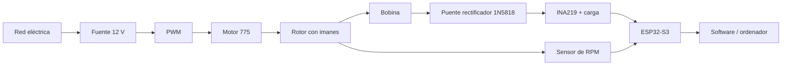

<div align="center">

# ⚡ Generador electromagnético experimental

### Manual visual de montaje, instrumentación y pruebas

**Motor 775 · Rotor con imanes · Bobina · Rectificador · INA219 · ESP32-S3 · Medición de RPM**

[](#-estado-del-proyecto)
[](#-qué-vamos-a-construir)
[](https://asturnando.github.io/generador/)

</div>

---

## 🎯 Qué es este proyecto

Este repositorio contiene el **manual vivo de construcción de una maqueta de generación electromagnética**.

El objetivo no es simplemente conseguir que se encienda algo, sino construir un banco de pruebas que permita estudiar de forma ordenada cómo cambian las medidas eléctricas al variar:

- el **número de imanes** del rotor;
- el **número de espiras** de la bobina;
- la **velocidad de giro**;
- y la configuración utilizada durante cada ensayo.

La maqueta será documentada paso a paso, con fotografías de los componentes reales, dibujos, esquemas de conexión, listas de comprobación y solución de fallos.

> La idea es que alguien que nunca haya montado un circuito pueda seguir el manual sin tener que adivinar qué significa «conectar la fuente al PWM».

---

## 🧩 Qué vamos a construir



El sistema se divide en dos partes muy claras:

### 🔵 Circuito que mueve el experimento

`Red → Fuente 12 V → PWM → Motor 775 → Rotor`

Su función es proporcionar un giro **controlado y repetible**.

### 🟢 Circuito que genera y mide

`Rotor → Bobina → Rectificador → INA219 → ESP32-S3`

Aquí es donde mediremos:

- **voltaje**;
- **corriente**;
- **potencia**;
- **RPM**;
- y posteriormente podremos registrar los ensayos en el ordenador.

---

## 🧲 Variables experimentales

La idea inicial es comparar configuraciones manteniendo el resto de condiciones lo más constantes posible.

| Variable | Configuraciones previstas |
|---|---|
| Imanes | 4 · 6 · 8 |
| Imanes principales | Neodimio redondo 15 × 2 mm |
| Espiras | 200 · 400 · 600 · 800 |
| Velocidad | Baja · media · alta |
| Medidas | V · A · W · RPM |

También disponemos de imanes rectangulares para pruebas auxiliares y un sensor Hall KY-003 como alternativa al sensor óptico de RPM.

---

## 🧰 Componentes principales

- Motor DC **775** con soporte y adaptador.
- Fuente conmutada **12 V / 10 A / 120 W**.
- Controlador **PWM 10–60 V / 20 A**.
- ESP32-S3 de **44 pines** con USB-C.
- Sensor de corriente y voltaje **INA219**.
- Sensor óptico **TCRT5000** para RPM.
- Sensor Hall **KY-003** como plan B.
- Protoboard de **830 puntos**.
- Diodos Schottky **1N5818** para construir el puente rectificador.
- Resistencias de potencia **100 Ω / 5 W**.
- Alambre de cobre esmaltado **AWG28**.
- 30 imanes redondos de neodimio **15 × 2 mm**.
- Imanes rectangulares adicionales.
- Cableado, terminales, tornillería, epoxi y elementos de fijación.

---

## 📚 Estructura del manual

El manual no se va a comprimir artificialmente. Cada operación tendrá el espacio que necesite.

| Capítulo | Contenido | Estado |
|---|---|---|
| **0** | Preparación, inventario, tablero, herramientas y seguridad | 🟢 En revisión |
| **1** | Cable de red → fuente → salida segura de 12 V | 🟡 Pendiente |
| **2** | PWM → motor 775 → primera puesta en movimiento | ⚪ Pendiente |
| **3** | Rotor, imanes, equilibrado y protección | ⚪ Pendiente |
| **4** | Construcción de la bobina y derivaciones | ⚪ Pendiente |
| **5** | Puente rectificador en protoboard | ⚪ Pendiente |
| **6** | Soldadura y conexión del INA219 | ⚪ Pendiente |
| **7** | ESP32-S3 y sensor de RPM | ⚪ Pendiente |
| **8** | Software, calibración y registro de datos | ⚪ Pendiente |
| **9** | Plan de ensayos y análisis de resultados | ⚪ Pendiente |
| **10** | Fallos frecuentes, diagnóstico y presentación | ⚪ Pendiente |

---

## 🌐 Manual web

La versión visual del manual se publicará mediante **GitHub Pages**:

### 👉 https://asturnando.github.io/generador/

El objetivo de la web es que pueda consultarse fácilmente desde móvil, tablet u ordenador mientras se monta la maqueta.

Las listas de comprobación, fotografías, esquemas y capítulos irán actualizándose a medida que avance el proyecto.

---

## ✅ Filosofía de montaje

Cada etapa seguirá siempre la misma estructura:

1. **Qué pieza tenemos delante.**
2. **Para qué sirve.**
3. **Qué necesitamos antes de empezar.**
4. **Montaje paso a paso.**
5. **Fotografía o esquema de la conexión.**
6. **Qué debemos comprobar antes de continuar.**
7. **Fallos habituales y cómo solucionarlos.**

No se pasa al siguiente capítulo hasta que el bloque anterior funciona correctamente.

---

## ⚠️ Seguridad

Este proyecto combina electrónica de baja tensión con una **fuente conectada a la red eléctrica** y un rotor mecánico.

Por eso:

- la conexión de red se realiza siempre con la fuente **desenchufada**;
- fase, neutro y tierra deben quedar correctamente identificados y protegidos;
- la hoja de sierra incluida con el kit del motor **no se utilizará**;
- el rotor experimental será ligero, no metálico y contará con protección;
- las primeras pruebas se harán a **baja velocidad**;
- antes de conectar el ESP32 se comprobarán tensiones y polaridades.

---

## 🧪 Qué queremos demostrar

El proyecto no pretende «crear energía de la nada».

El motor actúa como **banco de pruebas** y sustituye a una fuente mecánica variable como el viento. Esto permite comparar configuraciones de generador manteniendo una velocidad de giro conocida y repetible.

La pregunta experimental es, esencialmente:

> **¿Cómo influyen el número de imanes, las espiras de la bobina y la velocidad de giro en la potencia eléctrica obtenida?**

---

## 📁 Estructura del repositorio

```text
generador/
├── index.html          # Portada del manual web
├── capitulo-0.html     # Capítulo 0
├── README.md           # Este documento
└── assets/             # Imágenes, estilos y recursos a medida que crezca la web
```

---

## 🚧 Estado del proyecto

**En construcción activa.**

Los componentes están llegando y el manual se escribe al mismo tiempo que se valida el montaje real. Por eso puede haber cambios en conexiones, soportes o procedimientos cuando se inspeccionen físicamente las piezas.

Eso no es un problema: forma parte del propio proceso experimental.

---

<div align="center">

### ⚡ Construir · medir · comparar · corregir · repetir

**Proyecto de generador electromagnético experimental**

</div>
